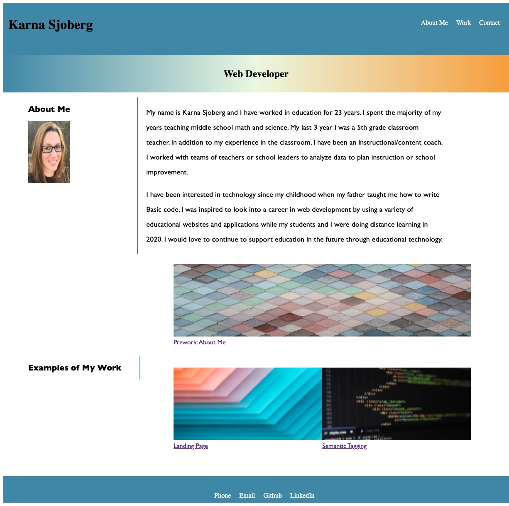

# Homework 1: Advanced-CSS:Portfoli
## Objective:

The objective of this assignment was to use the advanced CSS code we have been learning in class to create a portfolio that had 3 sections: About Me, My Work, and Contacts. The deployed code also needs to be responsive to different screen sizes. 

To start, I created the html file with all of the content that was needed to display on the page. Next, I created a style.css sheet and worked on each section one at a time to ensure that the styling matched the requirements of the assignment. 

## Screenshot of Homepage

## Link to deployed code
https://kesjoberg.github.io/adv-css-portfolio/
